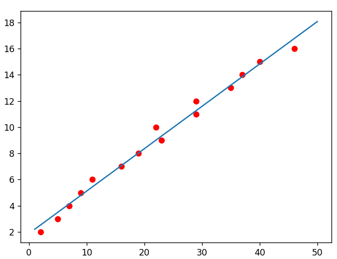
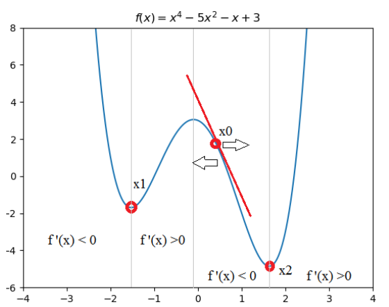

# Gradient Descent

### Concept

**Gradient descent:** is an iterative optimization problem algorithm for finding the minimum of a function.

**Learning rate:** is a important value in gradient descent algorithm.Learning rate is a proportional part of a model. The value of learning rate is affect algorithm speed.

* Learning rate is too big (divergence): overshoots the minimum point.
* Learning rate is too small (convergent): It is too slow to go down to minimun point.

### Compare gradient descent and formula

| Gradient Descent     | Formula         |
| ------------- |-------------| 
| Need to chose learning rate | No need to choose learning rate | 
| Needs many iteration | Don’t need to iterate |
| Work well even when n is large | Slow if n is very large |

### Description Algorithm

1. We need to random first value and learning rate for model
2. Calculate loss function (MSE)
3. Verivative loss function (MSE')
4. Update first value with formular: new_value = previous_value - learning_rate * MSE'
5. Repeat the process from step 3 to step 4 until the desired value is reached

### Prove

##### Line: y = ax + b

$$
Y=
\left(\begin{array}{cc} 
y1\\ 
y2\\
y3\\
...\\
yn
\end{array}\right)
X=
\left(\begin{array}{cc} 
x1\\ 
x2\\
x3\\
...\\
xn
\end{array}\right)
B=
\left(\begin{array}{cc} 
1\\ 
1\\
1\\
...\\
1
\end{array}\right)
A = 
\left(\begin{array}{cc} 
x1 & 1\\ 
x2 & 1\\
x3 & 1\\
...& ...\\
xn & 1
\end{array}\right)
x = 
\left(\begin{array}{cc} 
a\\ 
b
\end{array}\right)
$$ 
$$Y = aX + bB = A.x$$
**Mean square error (MSE)**
$$MSE = \frac{1}{N}\sum(y - y_.predict)^2$$
$$MSE = \frac{1}{N}\sum(Ax - Y)^2$$
$$MSE' = \frac{2A^T}{N}\sum(Ax - Y)$$

We need to find the minimum of graph so:

- If f'(x) < 0, we need to increase x with formula

- If f'(x) > 0, we need to decrease x with formula

$$formula: x_0 \to x_0 -\alpha.MSE'$$

$$m: number\ of\ training\ data\ point$$

$$\alpha: learning\ rate$$

<!-- #### Parabole y = ax^2 + bx + c

$$
Y=
\left(\begin{array}{cc} 
y1\\ 
y2\\
y3\\
...\\
yn
\end{array}\right)
A = 
\left(\begin{array}{cc} 
x1^2 & x1 & 1\\ 
x2^2 & x2 & 1\\
x3^2 & x3 & 1\\
.... & ... & ...\\
xn^2 & xn & 1
\end{array}\right)
$$
**Formula**
$$
\left(\begin{array}{cc} 
a\\ 
b\\
c
\end{array}\right)
 = (A'. A)^-1 . A'.Y
$$

### Code -->
