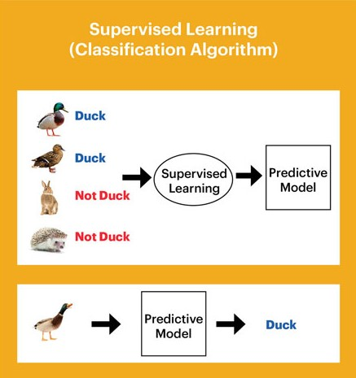
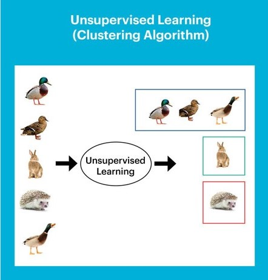

# Machine Learning

## Concept

Machine learning is a branch of artificial intelligence. It allows computer to learn from training data. After that, computer can predict (the value) or classify (handwriting, object),...

## Application

* Image Recognition
* Speech Recognition
* Recommender Systems
* Fraud Detection
* Self Driving Cars
* Medical Diagnosis
* Stock Market Trading
* Virtual Try On
  
## Classify

### Supervised learning (Mô hình học có giám sát)

**Supervised learning :** is a model learn from label data. The input data of the learning process includes the attribute vector and the result (label data). Supervised learning can predict the result (output) from input training data.
Ex Linear Regression, Detect object,...

### Unsupervised learning (Mô hình học không giám sát)

**Unsupervised learning :** is a model learn form data without label. The input data is divided into groups. The input data has the same properties are same group 
Ex k-Means, Data Visualization,... 

### Multi-Instance learning (Mô hình học theo nhóm)

**Multi-Instance learning :** is a special case of **Supervised learning**. The input data is devided into groups and the group is labeled.

### Semi-supervised learning (Mô hình học bán giám sát)

**Semi-supervised learning :** is a model includes **Supervised learning** and **Unsupervised learning**. Some input data are labeled and some are unlabelled (unlabelled > labelled).

### Self-supervised learning (Mô hình học tự giám sát)

**Self-supervised learning  :** the input data is unlabelled. Then model create label for data.

### Reinforcement learning (Mô hình học tăng cường)

**Reinforcement learning :** AlphaGo

## Dividing dataset

 **Training set:** is the dataset used to train the machine learning model.

 **Test set:** is the dataset used to test the machine learning model when we finish training and evaluate the results of the training.

 **Validation Set:** is the data set used to evaluate the performance of the model during training.

## Overfitting and Underfitting

**Overfitting:** the model is too complicated, accuracy is very high in training set but accuracy is not high in another set.

**Underfitting:** the model is too simple, accuracy is not high.

**Fit:** the model return good result 

