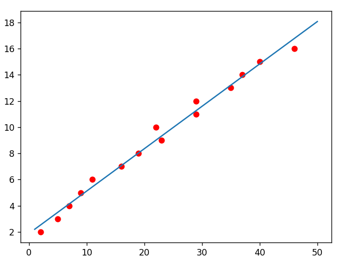

# Linear Regression

### Concept

**Linear regression:** is a type of supervised machine learning algorithm used to predict the value of a variable based on the value of another variable

### Prove

#### Line: y = ax + b

$$
Y=
\left(\begin{array}{cc} 
y1\\ 
y2\\
y3\\
...\\
yn
\end{array}\right)
X=
\left(\begin{array}{cc} 
x1\\ 
x2\\
x3\\
...\\
xn
\end{array}\right)
B=
\left(\begin{array}{cc} 
1\\ 
1\\
1\\
...\\
1
\end{array}\right)
A = 
\left(\begin{array}{cc} 
x1 & 1\\ 
x2 & 1\\
x3 & 1\\
...& ...\\
xn & 1
\end{array}\right)
x = 
\left(\begin{array}{cc} 
a\\ 
b
\end{array}\right)
$$ 
$$Y = aX + bB = A.x$$

$$vOB . vEY = 0$$

$$vOX . vEY = 0$$

$$vEY = vOy - vOE$$
$$vOE = a.vOX + b.vOB => E = aX + bB = A.x$$
$$B^T.(Y - A.x) = 0$$

$$X^T.(Y - A.x) = 0$$
$$B^T.Y - B^T.A.x = 0$$

$$X^T.Y - X^T.A.x = 0$$
$$=> A^T.Y - A^T.A.x = 0$$

$$=> A^T.Y = A^T.A.x$$
$$=> x = (A^T. A)^{-1} . A^T.Y$$

**Formula**
$$
\left(\begin{array}{cc} 
a\\ 
b
\end{array}\right)
 = (A^T. A)^{-1} . A^T.Y
$$

#### Parabole y = ax^2 + bx + c

$$
Y=
\left(\begin{array}{cc} 
y1\\ 
y2\\
y3\\
...\\
yn
\end{array}\right)
A = 
\left(\begin{array}{cc} 
x1^2 & x1 & 1\\ 
x2^2 & x2 & 1\\
x3^2 & x3 & 1\\
.... & ... & ...\\
xn^2 & xn & 1
\end{array}\right)
$$
**Formula**
$$
\left(\begin{array}{cc} 
a\\ 
b\\
c
\end{array}\right)
 = (A^T. A)^{-1} . A^T.Y
$$

### Squared loss: a popular loss function
$$ MSE = \frac{1}{N} \sum_{(x,y)\in D} (y - prediction(x))^2$$
* MSE: Mean square error
* N: the number of (x,y)
* (x,y): input data

### Covariance vs Correlation
**Covariance**
$$cov(X,Y) = E[(X-E(X)).(Y-E(Y))] E(XY) - E(X).E(Y)$$
**Correlation coefficient**
$$ρ(X,Y) = \frac{cov(X,Y)}{\sigma(X).\sigma(Y)}$$

| Covariance    | Covariance    |
|---------|---------|
|Indicates the direction of the linear relationship between variables | Indicates both the strength and direction of the linear relationship between two variables |
|Covariance values are not standard|Correlation values are standardized|
|Positive number being positive relationship and negative number being negative relationship|1 being strong positive correlation and -1 being strong negative correlation|
|Value between positive infinity to negative infinity|Value is strictly between -1 to 1|

 
 

